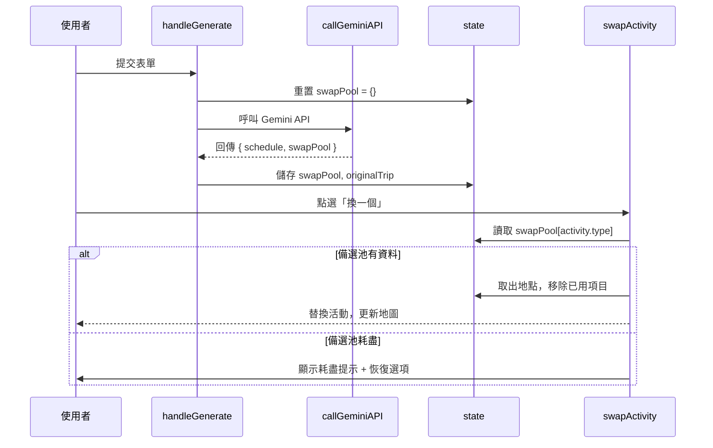

# 技術設計文件：gemini-itinerary-swap

## 概覽

本功能改善「換一個」按鈕的資料品質。目前 `swapActivity` 函式僅從靜態的 `swapFallbackPool` 隨機抽取假資料；改善後，系統將在初次呼叫 Gemini API 時，於同一個 Prompt 中一併請求分類備選池（`swapPool`），並將其儲存於 `state.swapPool`。使用者點選「換一個」時，系統優先從 `state.swapPool` 取出真實地點，備選耗盡時通知使用者並提供恢復原始建議的選項。

所有修改均在單一 `index.html` 的 `<script>` 區塊內完成，不引入任何外部模組或建置工具。

---

## 架構

本應用為 Vanilla JS 單頁應用，所有邏輯集中於 `index.html` 的 `<script>` 區塊。現有架構如下：

```
index.html
├── 全域狀態 (state)
├── 表單邏輯 (handleGenerate, callGeminiAPI, generateFallback)
├── 資料格式化 (formatTripData)
├── 渲染層 (renderDashboard, updateMapMarkers)
└── 互動邏輯 (selectActivity, swapActivity, deleteActivity)
```

本功能的修改範圍：

```
修改 callGeminiAPI     → Prompt 加入 swapPool 請求
修改 finishGenerate    → 儲存 swapPool 與 originalTrip 至 state
修改 generateFallback  → 從 swapFallbackPool 建構分類備選池
修改 swapActivity      → 從 state.swapPool 取出真實地點
新增 validateSwapPool  → 驗證並補全備選池資料格式
新增 showExhaustedDialog → 備選耗盡時顯示提示與恢復選項
修改 handleGenerate    → 重置 state.swapPool 於每次新請求前
```

### 資料流



---

## 元件與介面

### 修改：`callGeminiAPI(data, key)`

在現有 `promptText` 中加入 `swapPool` 的輸出要求。Prompt 新增段落：

```
同時，請在 JSON 根層級加入一個 "swapPool" 物件，結構為以 type 為鍵、地點陣列為值。
每個 type 分類至少包含 3 個備選地點，每個地點須包含 name、type、time、duration、rating、desc、lat、lng、tips 欄位。
type 的允許值與 schedule 相同：sightseeing, shopping, dining, nature, cafe, culture, accommodation, event。
```

回傳值從 `{ id, destination, schedule, isMock }` 擴充為 `{ id, destination, schedule, swapPool, isMock }`。

### 新增：`validateSwapPool(rawSwapPool, baseLat, baseLng)`

對 Gemini 回傳的 `swapPool` 進行防禦性驗證：

- 過濾掉缺少 `name` 欄位的項目
- 對缺少有效 `lat`/`lng` 的項目補上基於目的地中心點的隨機偏移座標（±0.05 度）
- 對每個通過驗證的項目執行 `formatTripData` 相同的欄位補全邏輯（`instanceId`、`icon`、`mappedTips`）
- 回傳結構：`{ [type: string]: Activity[] }`

### 修改：`finishGenerate(tripData)`

```js
function finishGenerate(tripData) {
  state.currentTrip = tripData;
  state.swapPool = tripData.swapPool || {};       // 新增
  state.originalTrip = deepClone(tripData);       // 新增
  // ... 其餘不變
}
```

### 修改：`generateFallback(data)`

在回傳前，將 `swapFallbackPool` 依 `type` 分類後填入 `raw.swapPool`：

```js
const swapPool = {};
swapFallbackPool.forEach(item => {
  if (!swapPool[item.type]) swapPool[item.type] = [];
  swapPool[item.type].push(item);
});
raw.swapPool = swapPool;
```

### 修改：`swapActivity(dayIdx, actIdx)`

新邏輯：

1. 取得 `oldAct = state.currentTrip.schedule[dayIdx].activities[actIdx]`
2. 取得當天已有的地點名稱集合（避免重複）
3. 從 `state.swapPool[oldAct.type]` 找出第一個不在當天行程中的地點
4. 若找到：取出、從池中移除、組裝 `newAct`（保留 `time`，產生 `swap-{timestamp}` instanceId）、呼叫 `selectActivity`
5. 若未找到：嘗試從 `swapFallbackPool` 中找同 `type` 的項目
6. 若仍未找到：呼叫 `showExhaustedDialog(dayIdx, actIdx)`

### 新增：`showExhaustedDialog(dayIdx, actIdx)`

在 DOM 中動態插入一個 Modal，包含：
- 提示文字：「目前沒有更多備選地點」
- 「恢復原始建議」按鈕 → 呼叫 `restoreOriginalActivity(dayIdx, actIdx)`
- 「取消」按鈕 → 關閉 Modal

### 新增：`restoreOriginalActivity(dayIdx, actIdx)`

1. 取得 `currentAct = state.currentTrip.schedule[dayIdx].activities[actIdx]`
2. 在 `state.originalTrip` 中搜尋對應 `instanceId` 的原始地點
3. 若找到：替換 `state.currentTrip.schedule[dayIdx].activities[actIdx]`，呼叫 `selectActivity`
4. 若未找到：顯示錯誤提示「無法取得原始建議資料」

### 修改：`handleGenerate(e)`

在呼叫 `callGeminiAPI` 之前加入：

```js
state.swapPool = {};
state.originalTrip = null;
```

---

## 資料模型

### 擴充後的 `state` 物件

```js
let state = {
  formData: { /* 不變 */ },
  currentTrip: null,          // TripData（含 schedule）
  originalTrip: null,         // TripData 深層複本，供恢復使用（新增）
  swapPool: {},               // { [type: string]: Activity[] }（新增）
  selectedActivityId: null,
  isEditing: false
};
```

### `Activity` 型別（補全後）

```ts
interface Activity {
  instanceId: string;         // 唯一識別碼，格式 act-xxx 或 swap-{timestamp}
  name: string;
  type: 'sightseeing' | 'shopping' | 'dining' | 'nature' | 'cafe' | 'culture' | 'accommodation' | 'event';
  time: string;               // HH:MM
  duration: string;
  rating: string;
  desc: string;
  lat: number;
  lng: number;
  tips: { text: string; category: string }[];
  icon: string;               // 由 iconMap 補全
  mappedTips: { text: string; icon: string; color: string }[];  // 由 tipStyleMap 補全
}
```

### `swapPool` 結構

```ts
interface SwapPool {
  [type: string]: Activity[];
}
// 範例：
// {
//   "sightseeing": [Activity, Activity, Activity],
//   "dining": [Activity, Activity, Activity],
//   "cafe": [Activity, Activity, Activity]
// }
```

### Gemini API 回傳格式（擴充後）

```json
{
  "schedule": [ /* 不變 */ ],
  "swapPool": {
    "sightseeing": [
      { "name": "...", "type": "sightseeing", "time": "...", "duration": "...", "rating": "...", "desc": "...", "lat": 0.0, "lng": 0.0, "tips": [] }
    ],
    "dining": [ /* ... */ ]
  }
}
```

---

## 正確性屬性

*屬性（Property）是一種在系統所有合法執行路徑中都應成立的特性或行為，本質上是對系統應做什麼的形式化陳述。屬性作為人類可讀規格與機器可驗證正確性保證之間的橋樑。*

### 屬性 1：備選池取出後縮減

*對任意* 含有至少一個可用地點的 `swapPool[type]`，執行一次 `swapActivity` 後，`state.swapPool[type]` 的長度應恰好減少 1。

**驗證：需求 2.4**

### 屬性 2：替換保留原始時間

*對任意* 活動執行 `swapActivity`，替換後的新活動 `time` 欄位應與被替換活動的 `time` 欄位相同。

**驗證：需求 2.5**

### 屬性 3：替換後 instanceId 唯一

*對任意* 一系列 `swapActivity` 操作，每次替換產生的 `instanceId` 格式應符合 `swap-{timestamp}`，且在同一行程中不重複。

**驗證：需求 2.5**

### 屬性 4：無名稱地點被排除

*對任意* 包含缺少 `name` 欄位項目的 `rawSwapPool`，經 `validateSwapPool` 處理後，`state.swapPool` 中不應存在任何 `name` 為空或未定義的地點。

**驗證：需求 3.3**

### 屬性 5：無效座標補全後為數字

*對任意* 缺少有效 `lat`/`lng` 的備選地點，經 `validateSwapPool` 處理後，該地點的 `lat` 與 `lng` 應皆為數字型別，且與目的地中心點的偏移量在 ±0.05 度範圍內。

**驗證：需求 3.2**

### 屬性 6：swapPool 永遠為物件

*對任意* 應用程式狀態（包含初始化、API 成功、API 失敗、重新規劃），`state.swapPool` 應永遠為一個物件，不為 `null` 或 `undefined`。

**驗證：需求 4.3**

### 屬性 7：備用模式備選池可用

*對任意* 使用 `generateFallback` 產生的行程（`isMock === true`），`state.swapPool` 應包含至少一個 `type` 鍵，且每個鍵對應的陣列長度大於 0。

**驗證：需求 1.5**

### 屬性 8：恢復原始建議為深層複本

*對任意* 行程，`state.originalTrip` 應為 `state.currentTrip` 的深層複本，對 `state.currentTrip` 的任何修改不應影響 `state.originalTrip` 中的對應資料。

**驗證：需求 5.6**

---

## 錯誤處理

| 情境 | 處理方式 |
|------|----------|
| Gemini 回傳 JSON 缺少 `swapPool` 欄位 | `state.swapPool = {}`，行程正常顯示（需求 1.4） |
| `swapPool` 解析失敗（格式錯誤） | catch 後設 `state.swapPool = {}`，不中斷流程（需求 1.4） |
| 備選地點缺少 `name` | 從池中排除該項目（需求 3.3） |
| 備選地點缺少有效座標 | 補上目的地中心點 ±0.05 度隨機偏移（需求 3.2） |
| `swapPool[type]` 為空或不存在 | 退回 `swapFallbackPool` 隨機抽取（需求 2.2） |
| `swapFallbackPool` 亦無同 type 地點 | 顯示耗盡 Modal，提供恢復原始建議選項（需求 2.3、5.1） |
| `state.originalTrip` 中找不到對應 instanceId | 顯示「無法取得原始建議資料」，維持現狀（需求 5.4） |
| API 完全失敗（使用 fallback） | `generateFallback` 自動建構 `swapPool`，確保功能可用（需求 1.5） |

---

## 測試策略

### 雙軌測試方法

本功能採用單元測試與屬性測試並行的策略，兩者互補：

- **單元測試**：驗證特定範例、邊界條件與錯誤情境
- **屬性測試**：以隨機輸入驗證普遍性規則，覆蓋大量輸入組合

### 單元測試重點

- `validateSwapPool`：空物件輸入、缺少 `name` 的項目被排除、缺少座標的項目被補全
- `swapActivity`：池有資料時正確取出並縮減、池耗盡時呼叫 `showExhaustedDialog`
- `restoreOriginalActivity`：找到對應 instanceId 時正確還原、找不到時顯示錯誤
- `finishGenerate`：`state.swapPool` 與 `state.originalTrip` 被正確設定
- `generateFallback`：回傳的 `swapPool` 依 type 正確分類

### 屬性測試

使用 **fast-check**（JavaScript 屬性測試函式庫）。每個屬性測試最少執行 **100 次迭代**。

每個測試須以註解標記對應設計屬性，格式：
`// Feature: gemini-itinerary-swap, Property {N}: {屬性描述}`

#### 屬性 1：備選池取出後縮減
```js
// Feature: gemini-itinerary-swap, Property 1: 備選池取出後縮減
fc.assert(fc.property(
  fc.array(arbitraryActivity, { minLength: 1 }),
  (pool) => {
    state.swapPool = { sightseeing: [...pool] };
    const before = state.swapPool.sightseeing.length;
    swapActivity(0, 0); // 假設 dayIdx=0, actIdx=0 為 sightseeing 類型
    return state.swapPool.sightseeing.length === before - 1;
  }
), { numRuns: 100 });
```

#### 屬性 4：無名稱地點被排除
```js
// Feature: gemini-itinerary-swap, Property 4: 無名稱地點被排除
fc.assert(fc.property(
  fc.array(arbitraryRawActivity),
  (items) => {
    const result = validateSwapPool({ sightseeing: items }, baseLat, baseLng);
    return (result.sightseeing || []).every(a => typeof a.name === 'string' && a.name.length > 0);
  }
), { numRuns: 100 });
```

#### 屬性 5：無效座標補全後為數字
```js
// Feature: gemini-itinerary-swap, Property 5: 無效座標補全後為數字
fc.assert(fc.property(
  fc.array(arbitraryActivityWithoutCoords),
  (items) => {
    const result = validateSwapPool({ dining: items }, baseLat, baseLng);
    return (result.dining || []).every(a => typeof a.lat === 'number' && typeof a.lng === 'number');
  }
), { numRuns: 100 });
```

#### 屬性 6：swapPool 永遠為物件
```js
// Feature: gemini-itinerary-swap, Property 6: swapPool 永遠為物件
fc.assert(fc.property(
  fc.option(fc.record({ swapPool: fc.option(fc.object()) })),
  (tripData) => {
    finishGenerate(tripData || {});
    return state.swapPool !== null && state.swapPool !== undefined && typeof state.swapPool === 'object';
  }
), { numRuns: 100 });
```

#### 屬性 8：恢復原始建議為深層複本
```js
// Feature: gemini-itinerary-swap, Property 8: 恢復原始建議為深層複本
fc.assert(fc.property(
  arbitraryTripData,
  (tripData) => {
    finishGenerate(tripData);
    const originalName = state.originalTrip.schedule[0].activities[0].name;
    state.currentTrip.schedule[0].activities[0].name = 'MUTATED';
    return state.originalTrip.schedule[0].activities[0].name === originalName;
  }
), { numRuns: 100 });
```
