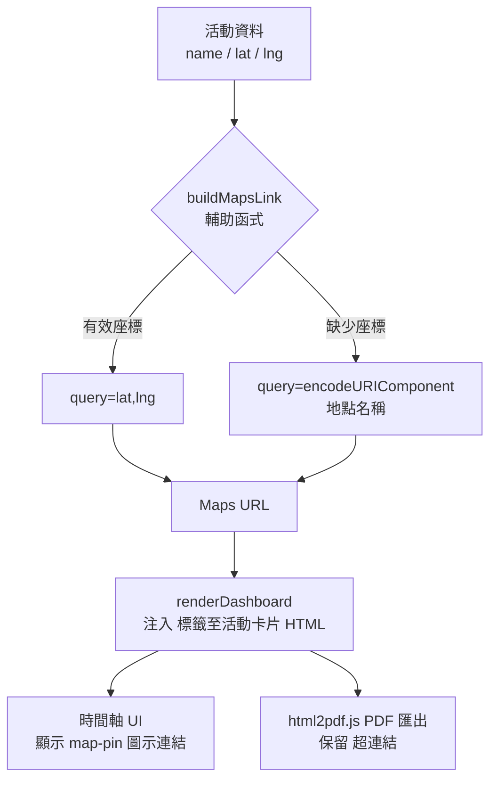

# 設計文件：地點 Google Maps 外部連結

## 概覽

本功能在「Gemini 實境旅遊規劃系統」（`index.html`）的行程時間軸中，為每個活動卡片加入 Google Maps 外部連結圖示。使用者可點擊圖示以新分頁開啟 Google Maps，查看該地點的位置與導航資訊。匯出 PDF 時，連結亦以可點擊超連結的形式保留於文件中。

---

## 架構

本功能完全在現有的單頁應用程式架構內實作，不引入新的外部依賴或模組系統。



**資料流：**
1. `formatTripData()` 處理原始活動資料，確保 `lat`/`lng` 欄位存在。
2. `renderDashboard()` 在組裝活動卡片 HTML 字串時，呼叫 `buildMapsLink()` 產生連結，並注入 `<a>` 標籤。
3. `html2pdf.js` 在匯出時直接擷取 DOM 中的 `<a>` 標籤，預設即保留超連結。

---

## 元件與介面

### `buildMapsLink(name, lat, lng)` 輔助函式

**位置：** 放置於 `index.html` 的 `<script>` 區塊中，緊接在 `iconMap` / `tipStyleMap` 等常數定義之後、`renderDashboard()` 之前。選擇此位置的理由：與其他純函式工具放在一起，且在 `renderDashboard()` 呼叫前已定義。

**介面：**

```javascript
/**
 * 產生指向 Google Maps 的搜尋連結。
 * @param {string} name - 地點名稱（用於備援搜尋）
 * @param {number|undefined|null} lat - 緯度
 * @param {number|undefined|null} lng - 經度
 * @returns {string} Google Maps 搜尋 URL
 */
function buildMapsLink(name, lat, lng) {
  const BASE = 'https://www.google.com/maps/search/?api=1&query=';
  if (typeof lat === 'number' && !isNaN(lat) &&
      typeof lng === 'number' && !isNaN(lng)) {
    return `${BASE}${lat},${lng}`;
  }
  return `${BASE}${encodeURIComponent(name)}`;
}
```

**邏輯說明：**
- 當 `lat` 與 `lng` 皆為有效數值（`typeof === 'number'` 且非 `NaN`）時，使用座標格式 `query=lat,lng`，精確度最高。
- 否則退回使用 `encodeURIComponent(name)` 進行地點名稱搜尋，支援中文及特殊字元。

---

### 活動卡片 HTML 注入點

**位置：** `renderDashboard()` 函式內，組裝 `timeHtml` 的迴圈中，`<h4>` 標籤內的 `${act.name}` 旁。

**修改前：**
```html
<h4 class="font-bold text-base mb-1 cursor-pointer ..."
    onclick="selectActivity('${act.instanceId}')">${act.name}</h4>
```

**修改後：**
```html
<h4 class="font-bold text-base mb-1 flex items-center gap-2 ${isSel ? 'text-blue-900' : isEvent ? 'text-amber-700' : 'text-slate-800'}">
  <span class="cursor-pointer" onclick="selectActivity('${act.instanceId}')">${act.name}</span>
  <a href="${buildMapsLink(act.name, act.lat, act.lng)}"
     target="_blank"
     rel="noopener noreferrer"
     class="text-slate-400 hover:text-blue-500 transition-colors flex-shrink-0"
     title="在 Google Maps 開啟">
    <i data-lucide="map-pin" class="w-4 h-4"></i>
  </a>
</h4>
```

**設計決策：**
- 使用 `map-pin` 圖示（Lucide，已透過 CDN 載入），與應用程式整體視覺風格一致。
- `<a>` 標籤與地點名稱並排，使用 `flex items-center gap-2` 對齊。
- 地點名稱的 `onclick` 保留在 `<span>` 上，不影響原有的地圖選取互動。
- 連結圖示預設為低調的 `text-slate-400`，hover 時變為 `text-blue-500`，避免干擾主要內容閱讀。
- 編輯模式（`isEditing`）不影響連結顯示，因為連結注入邏輯不依賴 `isEditing` 狀態。

---

## 資料模型

本功能不新增或修改任何資料模型。所有必要欄位（`name`、`lat`、`lng`）已存在於活動資料結構中：

```typescript
// 現有活動資料結構（相關欄位）
interface Activity {
  name: string;       // 地點名稱，用於備援搜尋
  lat: number;        // 緯度，由 formatTripData() 確保存在
  lng: number;        // 經度，由 formatTripData() 確保存在
  instanceId: string; // 唯一識別碼
  type: string;       // 活動類型（含 accommodation、event）
  // ... 其他欄位
}
```

`buildMapsLink()` 在 `renderDashboard()` 渲染時即時計算連結，不需要在資料模型中預先儲存 URL。

---

## 正確性屬性

*屬性（Property）是指在系統所有有效執行情境下都應成立的特性或行為，本質上是對系統應做什麼的形式化陳述。屬性作為人類可讀規格與機器可驗證正確性保證之間的橋樑。*

### 屬性 1：有效座標產生座標格式 URL

*對於任意* 有效的地點名稱、有效的緯度數值與有效的經度數值，`buildMapsLink` 回傳的 URL 應包含 `query=<lat>,<lng>` 格式的參數。

**驗證需求：1.1、4.3**

---

### 屬性 2：缺少座標時退回名稱搜尋

*對於任意* 有效的地點名稱，當 `lat` 或 `lng` 為無效值（`undefined`、`null`、`NaN`、非數值字串）時，`buildMapsLink` 回傳的 URL 應包含 `query=<encodeURIComponent(name)>` 格式的參數，且中文字元應被正確編碼。

**驗證需求：1.2、1.4、4.4**

---

### 屬性 3：所有活動卡片均包含正確的 Maps 連結標籤

*對於任意* 活動類型（包含 `accommodation`、`event`）的活動清單，`renderDashboard()` 渲染後，每個活動卡片的 HTML 應包含一個 `<a>` 標籤，且該標籤具備：
- `href` 指向 `https://www.google.com/maps/search/` 開頭的 URL
- `target="_blank"` 屬性
- `rel="noopener noreferrer"` 屬性

**驗證需求：2.1、2.2、2.3、1.3**

---

### 屬性 4：編輯模式不影響 Maps 連結顯示

*對於任意* 活動清單，無論 `state.isEditing` 為 `true` 或 `false`，`renderDashboard()` 渲染後每個活動卡片均應包含 Maps 連結 `<a>` 標籤。

**驗證需求：2.4**

---

### 屬性 5：buildMapsLink 的冪等性

*對於任意* 相同的 `name`、`lat`、`lng` 輸入，多次呼叫 `buildMapsLink` 應每次回傳完全相同的 URL 字串。

**驗證需求：4.2**

---

## 錯誤處理

| 情境 | 處理方式 |
|------|----------|
| `lat`/`lng` 為 `undefined` 或 `null` | `buildMapsLink` 退回使用地點名稱搜尋 |
| `lat`/`lng` 為 `NaN` | `isNaN()` 檢查捕捉，退回名稱搜尋 |
| `lat`/`lng` 為非數值字串 | `typeof !== 'number'` 檢查捕捉，退回名稱搜尋 |
| `name` 包含中文或特殊字元 | `encodeURIComponent()` 正確編碼 |
| html2pdf.js 無法保留超連結 | `<a>` 標籤的 `href` 文字在 PDF 中仍可見，使用者可手動複製 |

`formatTripData()` 已確保所有活動的 `lat`/`lng` 為有效數值（若原始資料缺少則賦予預設值），因此在正常流程中 `buildMapsLink` 幾乎不會觸發備援邏輯。備援邏輯主要作為防禦性設計，應對未來資料來源變更的情況。

---

## 測試策略

### 雙軌測試方法

本功能採用**單元測試**與**屬性測試**並行的策略：

- **單元測試**：驗證特定範例、邊界條件與錯誤情境
- **屬性測試**：驗證適用於所有輸入的通用屬性

兩者互補，共同提供完整的正確性保證。

---

### 單元測試（具體範例）

以下為應涵蓋的具體測試案例：

```javascript
// 範例 1：有效座標
buildMapsLink('台北 101', 25.0339, 121.5645)
// 預期：'https://www.google.com/maps/search/?api=1&query=25.0339,121.5645'

// 範例 2：缺少座標（undefined）
buildMapsLink('台北 101', undefined, undefined)
// 預期：'https://www.google.com/maps/search/?api=1&query=%E5%8F%B0%E5%8C%97%20101'

// 範例 3：中文地點名稱編碼
buildMapsLink('碧瑤市場', null, null)
// 預期：URL 包含 encodeURIComponent('碧瑤市場')

// 範例 4：NaN 座標
buildMapsLink('某地點', NaN, NaN)
// 預期：退回名稱搜尋格式

// 範例 5：accommodation 類型活動卡片包含連結
// 渲染含 accommodation 活動的儀表板後，驗證 DOM 中存在 maps <a> 標籤
```

---

### 屬性測試（使用 fast-check）

本專案已載入 `fast-check`（`https://cdn.jsdelivr.net/npm/fast-check/lib/bundle/fast-check.min.js`），直接沿用現有測試基礎設施。

每個屬性測試最少執行 **100 次迭代**。

```javascript
// Feature: location-google-map-links, Property 1: 有效座標產生座標格式 URL
fc.assert(fc.property(
  fc.string({ minLength: 1 }),
  fc.double({ min: -90, max: 90, noNaN: true }),
  fc.double({ min: -180, max: 180, noNaN: true }),
  (name, lat, lng) => {
    const url = buildMapsLink(name, lat, lng);
    return url.includes(`query=${lat},${lng}`);
  }
), { numRuns: 100 });

// Feature: location-google-map-links, Property 2: 缺少座標時退回名稱搜尋
fc.assert(fc.property(
  fc.string({ minLength: 1 }),
  fc.oneof(fc.constant(undefined), fc.constant(null), fc.constant(NaN), fc.string()),
  fc.oneof(fc.constant(undefined), fc.constant(null), fc.constant(NaN), fc.string()),
  (name, lat, lng) => {
    const url = buildMapsLink(name, lat, lng);
    return url.includes(`query=${encodeURIComponent(name)}`);
  }
), { numRuns: 100 });

// Feature: location-google-map-links, Property 3: 所有活動卡片均包含正確的 Maps 連結標籤
// （需在 DOM 環境中執行，驗證渲染後的 HTML 結構）

// Feature: location-google-map-links, Property 4: 編輯模式不影響 Maps 連結顯示
// （切換 state.isEditing，驗證連結仍存在）

// Feature: location-google-map-links, Property 5: buildMapsLink 的冪等性
fc.assert(fc.property(
  fc.string({ minLength: 1 }),
  fc.oneof(fc.double({ noNaN: true }), fc.constant(undefined)),
  fc.oneof(fc.double({ noNaN: true }), fc.constant(undefined)),
  (name, lat, lng) => {
    return buildMapsLink(name, lat, lng) === buildMapsLink(name, lat, lng);
  }
), { numRuns: 100 });
```

**標籤格式：** 每個屬性測試以註解標記 `Feature: location-google-map-links, Property <N>: <屬性描述>`，便於追蹤。
